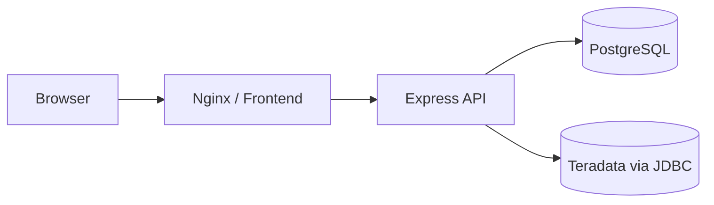

# TD::MONITOR
> Plataforma de monitoramento para Teradata — Dashboard em tempo real.

## Visão Geral
O **TD::MONITOR** é uma aplicação fullstack para acompanhar capacidade, performance, segurança e sessões do ambiente Teradata em um dashboard web. A solução agenda consultas SQL, coleta os resultados via JDBC, aplica mapeamentos de campos, persiste cache no PostgreSQL e expõe dados em API para visualização em tempo real no frontend.

<!-- screenshot -->

### Stack tecnológica
- **Frontend:** React + Vite + TypeScript + Tailwind CSS + React Query
- **Backend:** Node.js + Express + TypeScript + TypeORM + node-cron
- **Banco interno:** PostgreSQL 16
- **Integração Teradata:** JDBC (`terajdbc4.jar`) via `jdbc`/`jinst`
- **Orquestração:** Docker Compose (desenvolvimento e produção)

## Pré-requisitos
- Docker >= 24.0 e docker-compose >= 2.20
- Teradata JDBC Driver (`terajdbc4.jar`) — download no site oficial da Teradata: https://downloads.teradata.com/download/connectivity/jdbc-driver
- Acesso de leitura às views DBC do Teradata (ex.: `DBC.DiskSpaceV`, `DBC.DBQLogTbl`, etc.)

## Quick Start
```bash
# 1. Clone o repositório
git clone <repo-url>
cd td-monitor

# 2. Configure o ambiente
cp .env.example .env
# Edite o .env com suas configurações

# 3. Coloque o driver JDBC do Teradata
mkdir -p jdbc
cp /caminho/do/terajdbc4.jar ./jdbc/

# 4. Suba os containers
docker-compose up --build -d

# 5. Acesse
# Frontend: http://localhost
# Backend API: http://localhost:3001/api/health
```

## Configuração Inicial (Pós-Deploy)
1. Acesse http://localhost
2. Vá em Configurações > Conexões
3. Crie uma conexão Teradata com os dados do seu servidor
4. Teste a conexão
5. Vá em Configurações > Agendamentos
6. Crie um agendamento (ex: a cada 15 minutos) vinculando os painéis desejados
7. Clique em "Executar Agora" para popular o dashboard imediatamente
8. Volte ao Dashboard e veja os dados

## Estrutura do Projeto
```text
td-monitor/
├── backend/                 # API Express, entidades TypeORM, serviços de integração e scheduler
│   ├── src/
│   │   ├── config/          # Variáveis de ambiente e conexão com banco
│   │   ├── entities/        # Modelos persistidos (conexões, painéis, schedules, logs, cache)
│   │   ├── middlewares/     # Tratamento de erros e validações
│   │   ├── routes/          # Endpoints REST (/connections, /panels, /schedules, /dashboard, /logs)
│   │   ├── services/        # JDBC Teradata, cache, criptografia, scheduler, SSE, mapeamento
│   │   └── utils/           # Helpers de resposta de API
│   └── Dockerfile           # Build da API para contêiner
├── frontend/                # SPA React (dashboard e telas administrativas)
│   ├── src/
│   │   ├── components/      # Componentes reutilizáveis
│   │   ├── pages/           # Páginas (Dashboard, Conexões, Painéis, Schedules, Logs)
│   │   ├── services/        # Cliente HTTP da API
│   │   ├── styles/          # Estilos globais
│   │   └── types/           # Tipagens compartilhadas
│   └── Dockerfile           # Build multi-stage e entrega via nginx
├── database/
│   ├── init.sql             # Schema e índices do PostgreSQL
│   └── seed.sql             # Painéis e dados iniciais
├── docker-compose.yml       # Compose para desenvolvimento/local
├── docker-compose.prod.yml  # Compose para produção
├── Makefile                 # Comandos utilitários para operação local
├── .env.example             # Variáveis base para configuração
└── README.md                # Documentação do projeto
```

## Variáveis de Ambiente
| Variável | Default | Descrição |
|---|---|---|
| `NODE_ENV` | `development` | Ambiente de execução do backend. |
| `FRONTEND_PORT` | `80` | Porta exposta pelo container frontend (nginx). |
| `VITE_API_BASE_URL` | `http://localhost:3001/api` | URL base da API utilizada pelo frontend. |
| `BACKEND_PORT` | `3001` | Porta pública da API backend. |
| `BACKEND_PLATFORM` | `linux/amd64` | Plataforma Docker do backend (recomendado em hosts ARM para compatibilidade do módulo JDBC/Java). |
| `CORS_ORIGIN` | `http://localhost` | Origem permitida para CORS na API. |
| `ENCRYPTION_KEY` | `12345678901234567890123456789012` | Chave AES-256-GCM (32 chars) para criptografia de senhas Teradata. |
| `TERADATA_TIMEOUT_MS` | `30000` | Timeout de conexão/consulta ao Teradata (ms). |
| `CACHE_TTL_MINUTES` | `15` | TTL do cache dos painéis no PostgreSQL. |
| `POSTGRES_PORT` | `5432` | Porta pública do PostgreSQL. |
| `POSTGRES_DB` | `td_monitor` | Nome do banco PostgreSQL. |
| `POSTGRES_USER` | `td_monitor_user` | Usuário do PostgreSQL. |
| `POSTGRES_PASSWORD` | `td_monitor_pass` | Senha do PostgreSQL. |
| `DB_HOST` | `db` | Host do banco usado pela API (rede interna). |
| `DB_PORT` | `5432` | Porta do banco usada pela API. |
| `DB_USERNAME` | `td_monitor_user` | Usuário do banco usado pela API. |
| `DB_PASSWORD` | `td_monitor_pass` | Senha do banco usada pela API. |
| `DB_DATABASE` | `td_monitor` | Nome do banco usado pela API. |
| `TERADATA_USERNAME` | `dbc` | Usuário Teradata padrão (fallback). |
| `TERADATA_PASSWORD` | `dbc` | Senha Teradata padrão (fallback). |
| `TERADATA_JDBC_DRIVER_CLASS` | `com.teradata.jdbc.TeraDriver` | Classe Java do driver JDBC Teradata. |
| `TERADATA_JDBC_JAR_PATH` | `/opt/teradata/jdbc/terajdbc4.jar` | Caminho do JAR JDBC no container backend. |

## Painéis Pré-configurados
> Os painéis abaixo já são incluídos no `database/seed.sql` com queries placeholder (`Query X.Y`) para você substituir pelo SQL oficial do seu ambiente.

### Lista rápida de `panel_key` possíveis
```text
system_disk_total
disk_by_database
disk_forecast
underutilized_databases
top_skew
high_cpu_queries
failed_logins
brute_force
inactive_users
access_by_database_rights
database_query_activity
critical_db_activity
active_sessions
sessions_by_user
logon_pattern
query_status
permission_analysis
```

| # | Painel (`panel_key`) | Categoria | Query de referência |
|---|---|---|---|
| 1 | `system_disk_total` | `storage` | Query 1.1 |
| 2 | `disk_by_database` | `storage` | Query 1.2 |
| 3 | `disk_forecast` | `storage` | Query 1.3 |
| 4 | `underutilized_databases` | `storage` | Query 1.4 |
| 5 | `top_skew` | `performance` | Query 2.1 |
| 6 | `high_cpu_queries` | `performance` | Query 2.4 |
| 7 | `failed_logins` | `security` | Query 3.1 |
| 8 | `brute_force` | `security` | Query 3.2 |
| 9 | `inactive_users` | `security` | Query 3.3 |
| 10 | `access_by_database_rights` | `security` | Query 3.4 |
| 11 | `database_query_activity` | `performance` | Query 4.1 |
| 12 | `critical_db_activity` | `performance` | Query 4.2 |
| 13 | `active_sessions` | `sessions` | Query 5.1 |
| 14 | `sessions_by_user` | `sessions` | Query 5.2 |
| 15 | `logon_pattern` | `sessions` | Query 5.3 |
| 16 | `query_status` | `performance` | Query 5.4 |

## Arquitetura


### Fluxo de dados
1. `Schedule` ativo dispara execução via `node-cron`.
2. Backend consulta o Teradata usando JDBC.
3. Resultado é transformado pelo `MappingService`.
4. Dados mapeados são salvos no cache (`panel_data_cache`) no PostgreSQL.
5. API entrega os dados ao dashboard e emite eventos SSE quando houver atualização.

## Customização
### Como criar um novo painel
1. Acesse **Configurações > Painéis**.
2. Informe `panel_key`, nome, categoria e conexão.
3. Defina a query SQL e mapeamentos de campo (`source_column` → `target_field`).
4. Salve e associe o painel a um agendamento ativo.

### Como modificar uma query
1. Abra o painel existente em **Configurações > Painéis**.
2. Atualize o SQL no editor.
3. Salve e execute "Executar Agora" no agendamento para validar.

### Como adicionar um novo campo no mapeamento
1. No painel, adicione uma entrada em `field_mappings.mappings`.
2. Configure tipo (`string`, `number`, `date`, etc.) e formato opcional.
3. Salve e valide no dashboard/logs de execução.

### Como alterar o tema visual
1. Ajuste variáveis e classes em `frontend/src/styles/index.css`.
2. Atualize componentes/páginas em `frontend/src/components` e `frontend/src/pages` quando necessário.
3. Rebuild do frontend (`docker compose build frontend`) para refletir alterações em produção.

## Troubleshooting
- **"Conexão com Teradata falhou"** → verifique host, porta, firewall e se o JAR JDBC está disponível.
- **"Dados não aparecem no dashboard"** → confirme se o schedule está ativo e verifique logs em **Logs de Execução**.
- **"Erro JDBC ClassNotFound"** → confirme se `terajdbc4.jar` está em `./jdbc/` e montado no volume do backend.
- **Build em Mac (Apple Silicon) falhando no módulo `java/jdbc`** → mantenha `BACKEND_PLATFORM=linux/amd64` no `.env` para build/execução compatível.
- **Container não sobe** → rode `docker-compose logs <serviço>` e revise variáveis em `.env`.

## Permissões Necessárias no Teradata
O usuário técnico precisa de `SELECT` nas seguintes views/tabelas DBC:
- `DBC.DiskSpaceV`
- `DBC.DatabasesV`
- `DBC.TableSizeV`
- `DBC.DBQLogTbl`
- `DBC.DBQLObjTbl`
- `DBC.LogOnOffV`
- `DBC.UsersV`
- `DBC.AllRightsV`
- `DBC.SessionInfoV`

## Licença
MIT
